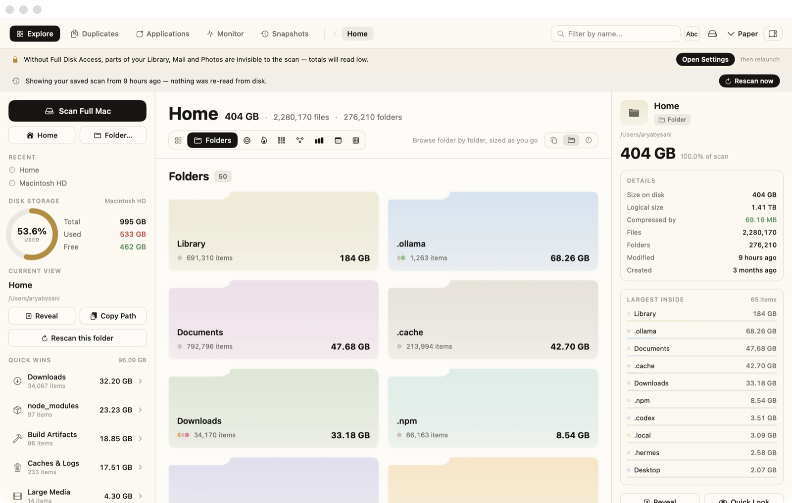
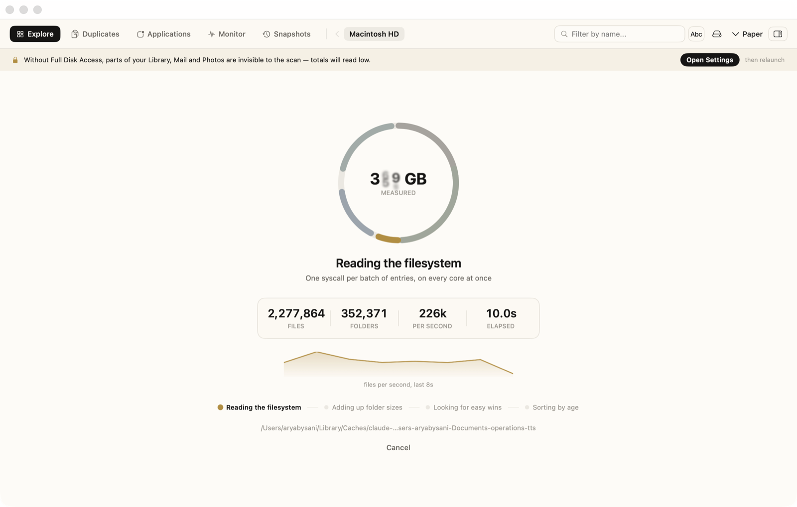
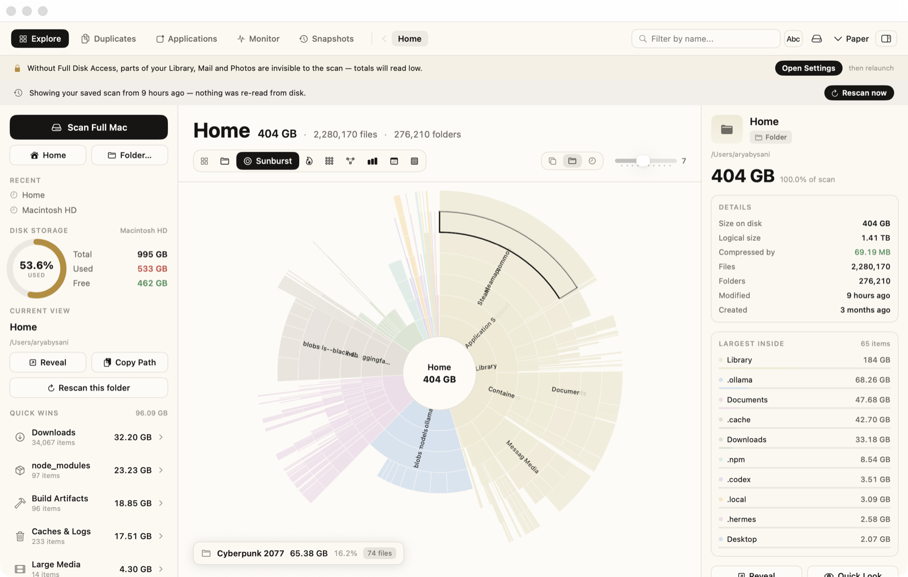
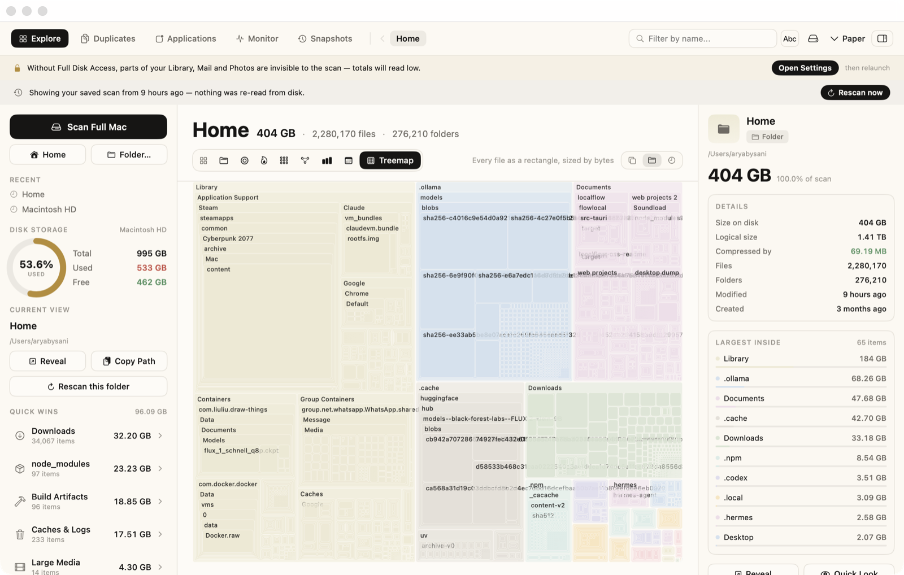
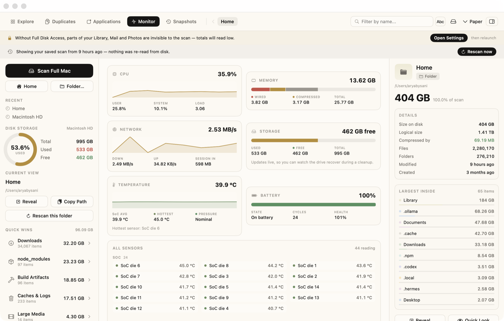

<p align="center">
  
</p>

<h1 align="center">Disk Visualizer</h1>

<p align="center">
  <em>Where did 400 GB go?</em><br>
  A fast macOS disk-space visualizer — eight views of one scan,<br>
  clone-aware duplicate detection, and nothing deleted without your say-so.
</p>

<p align="center">
  
  
  
  
</p>

---

Your Mac fills up and Finder is useless at telling you why. Get Info on a folder
and wait. Sort by size and you get the top of one directory, not the top of your
disk. This scans **2.55 million files in about twelve seconds** and then lets you
look at the result eight different ways until the culprit is obvious.

It was built by working out how [DiskBuddy](https://www.diskbuddy.com) does it —
the speed, the layouts, the safety rules — and rebuilding it from scratch in
Swift. `docs/DESIGN.md` is the teardown.

<p align="center">
  
</p>

## Install

You need macOS 14 or later and Xcode command-line tools. If `swift --version`
prints something, you're ready; if not:

```bash
xcode-select --install
```

Then:

```bash
git clone https://github.com/aryacooks/Disk-Visualizer.git
cd Disk-Visualizer
./scripts/bundle-app.sh
open "Disk Buddy Checker.app"
```

That's it. One script builds a release binary, wraps it in a proper `.app`, and
ad-hoc signs it. Drag the bundle to `/Applications` if you want it to stick
around.

<details>
<summary><b>"Apple could not verify this app"</b></summary>

The bundle is signed ad-hoc, not notarized — Gatekeeper doesn't know it. Right
click the app → **Open** → **Open**, once. Or:

```bash
xattr -dr com.apple.quarantine "Disk Buddy Checker.app"
```
</details>

<details>
<summary><b>Full Disk Access</b></summary>

Without it macOS silently hides parts of your disk from the scan, and your
totals come out too small. The app detects this and shows a banner with a button
that deep-links to the right Settings pane — it never quietly under-reports.

**System Settings → Privacy & Security → Full Disk Access → +** → pick the app.

macOS keys these grants to *code identity*, which is why the build script signs
with a stable identifier. Grant it once and every future build inherits it.
</details>

## Dev mode

```bash
./scripts/dev.sh
```

Debug build → bundled → signed → launched in the foreground, so `print` output
and crash traces come straight back to your terminal. Ctrl-C quits. Any previous
dev instance is killed first, so you're never looking at a stale build.

```bash
./scripts/dev.sh --build     # build, don't launch
```

It bundles rather than running `.build/debug/DiskBuddyApp` directly on purpose.
The bare binary *does* launch, but it has no stable code identity — so macOS
treats every rebuild as a brand-new app and re-asks for Documents, Downloads and
Desktop access every single time. The dev bundle carries the same fixed
identifier as the release one, so one grant covers them both.

For iterating on the engine itself, skip the GUI entirely — this loop is far
tighter, and it's where every algorithm bug in this project was actually caught:

```bash
swift run -c release dbscan ~ -n 20
```

## While it scans

<p align="center">
  
</p>

A scan takes over the whole window, sidebar and inspector included. That's
deliberate: anything left on screen would be the *previous* scan's numbers,
which look live and aren't. Partial results are worse than stale ones here —
subtree sizes don't exist until the reverse pass runs, so a half-built tree
reads 0 B for every folder and sorts by noise.

Every number on that screen is measured. The counters are the scanner's own,
the graph is real throughput sampled once a second, and the ring is honestly
indeterminate — a filesystem doesn't tell you how big it is before you've
walked it, so a percentage there would be invented.

The four stages are named as they happen — reading, adding up folder sizes,
looking for easy wins, sorting by age — because a scan isn't one job, and the
last three used to run behind a spinner that had already stopped moving. A
finished walk looked exactly like a hang.

## Releasing

```bash
./scripts/release.sh 1.0.0 --publish
```

Builds, signs with a Developer ID, notarizes with Apple, staples the ticket,
packages a drag-to-Applications DMG, and creates the GitHub release. It checks
everything up front and fails loudly rather than dying four minutes into a
notarization.

It needs three things it can't create for you: an Apple Developer Program
membership, a *Developer ID Application* certificate in your keychain, and a
stored `notarytool` credential profile. The script's header walks through all
three. Credentials are read from the keychain by profile name — no secret is
ever passed on a command line or written into this repo.

The icon is generated from code by `scripts/make-icon.swift`, so it lives in git
as something you can read and tweak instead of an opaque binary. Each of the ten
sizes is drawn natively rather than downscaled: below 128 px the tile grows, the
ring thickens and the pastels deepen, because a design tuned for 512 px turns
into a beige smudge in the Dock.

## What's in it

**Eight views, one scan.** Folders, Sunburst, Flame, Bubbles, Mind Map, Top
Sizes, Age Map, Treemap. Switching views is instant because they're all just
different projections of the same tree in memory.

<table>
<tr>
<td width="50%"></td>
<td width="50%"></td>
</tr>
<tr>
<td><b>Sunburst</b> — every ring is a directory level, every arc sized by what it holds. Hover any arc for its size and share.</td>
<td><b>Treemap</b> — every file as a rectangle, sized by bytes. Layout culls anything too small to see, so 907k nodes become 11k cells.</td>
</tr>
</table>

**Duplicates that aren't fooled.** A three-stage funnel — group by exact size,
hash the first and last 4 KB, then full SHA-256 only for the survivors. On a real
home folder that's 823,921 same-size files narrowed to 57,144 genuine groups. It
knows an APFS clone shares its blocks and frees nothing when deleted, so it finds
them and *excludes* them. Hardlinks never show up as duplicates at all.

**Snapshots and diffs.** Every scan is saved (907k nodes → 12.5 MB, loads back in
37 ms). Compare any two and see exactly what grew.

**Uninstall completely.** Deleting an app leaves caches, preferences, saved state
and support files scattered across 17 Library roots. This finds them and ranks
each by confidence — exact bundle-ID match, app name, or just a name fragment.

**Monitor.** CPU, memory, network, per-process disk I/O, and on-die temperatures
in Celsius, plus battery health and cycle count.

<p align="center">
  
</p>

## Nothing gets deleted

Every path that can remove something follows the same rules, no exceptions:

- Files are moved to the **Trash** with `trashItem`, never `unlink`. Everything
  is recoverable.
- Nothing is removed when you stage it. A review sheet with a running total and
  an explicit confirm always comes first.
- Every item is **re-measured and re-checked at the moment you confirm**, not
  when it was queued.
- A hard denylist — `/System`, `/bin`, `/sbin`, `/Library/Apple`, `/usr`
  (except `/usr/local`), your home root, volume roots — can't be staged at all,
  regardless of what the UI does.
- Duplicates starts with **nothing** ticked, never pre-selects a keeper or a
  clone, and refuses to empty a group of its last copy.
- Only exact bundle-ID matches are pre-ticked when uninstalling. Name-only
  matches are shown, unticked, for you to judge.
- Running apps are detected and skipped.

## How it's fast

The whole design follows from one number: **200,000 entries per second**.

The usual approach — `readdir` then `lstat` every entry — costs two-plus
syscalls per file. At 2.5 million files that's five million context switches and
you've already lost. `getattrlistbulk(2)` returns a batch of entries *and* their
metadata in a single call, roughly one syscall per 50–200 entries.

Results go into a flat struct-of-arrays arena — parallel `parent`, `childStart`,
`logical`, `mtime` arrays and one contiguous UTF-8 blob of names — at about 55
bytes a node, against 150–250 for a class-per-node object graph. Children are
always allocated after their parent, so subtree totals fall out of a single
reverse pass in O(n).

Layouts cull before they lay out: recursion stops when a rectangle is too small
to see. That's how 907,000 nodes become 11,159 treemap cells, and why layout cost
barely depends on file count.

Measured on a 2.55M-entry home folder: **205k entries/sec** warm, and totals that
match `du` exactly.

## Verifying

```bash
./scripts/verify.sh
```

Eight checks: scanner totals vs `du` including hardlink de-duplication, all five
layout algorithms, the duplicate funnel against a purpose-built fixture, the
snapshot round-trip and self-diff, the temperature sensors, the system sampler,
and app bundle sizes vs `du`.

The duplicate fixture is the sharpest test here. It builds five files of
identical size — an original, an APFS clone (`cp -c`), a genuine copy, a
hardlink, and a same-size file with different bytes — and asserts the funnel
reports **8 MB reclaimable, not 16 MB**. The hardlink never appears, the
different file dies at stage 2, and the clone is found but excluded because
deleting it would free nothing.

## Layout

```
Sources/ScannerCore/     the engine — no SwiftUI, so it's testable headlessly
Sources/DiskBuddyApp/    the SwiftUI app
Sources/dbscan/          the CLI, which doubles as benchmark and test rig
docs/DESIGN.md           how it works, and the bugs that ruin disk tools
docs/BUILD_PROMPT.md     the phase-by-phase build brief
scripts/                 bundle-app.sh, dev.sh, verify.sh
```

Every layout algorithm and every scanner behaviour lives in `ScannerCore` as a
pure function, provable from the command line before any pixel is drawn. That
wasn't the original plan — it's what the sunburst taught us after it spent an
afternoon rendering its hub and nothing else, while the algorithm behind it was
correct the whole time.

## Status

| | |
|---|---|
| Scanner core — `getattrlistbulk`, flat arena | done, 205k entries/sec |
| All eight views | done |
| Applications + Uninstall Completely | done |
| Monitor — CPU, memory, network, disk I/O | done |
| Duplicates — 3-stage funnel, clone-aware | done |
| Snapshots — save, load, diff | done |
| Thermals — on-die temps + battery | done |
| Staged cleanup queue | done |
| App icon | done, generated from code |
| Notarization + DMG + release pipeline | done, needs an Apple Developer account to run |

## License

MIT.
